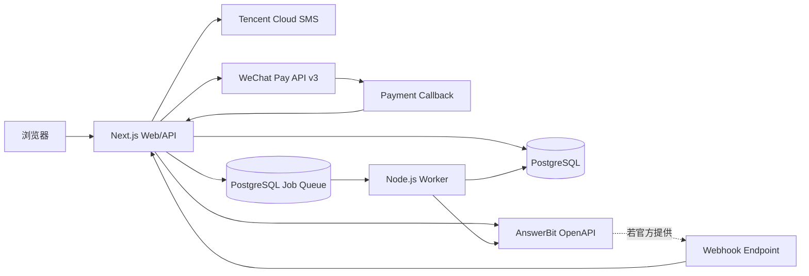
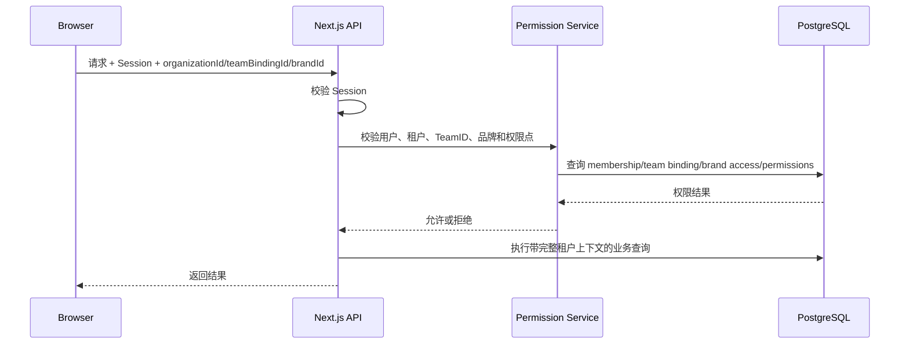
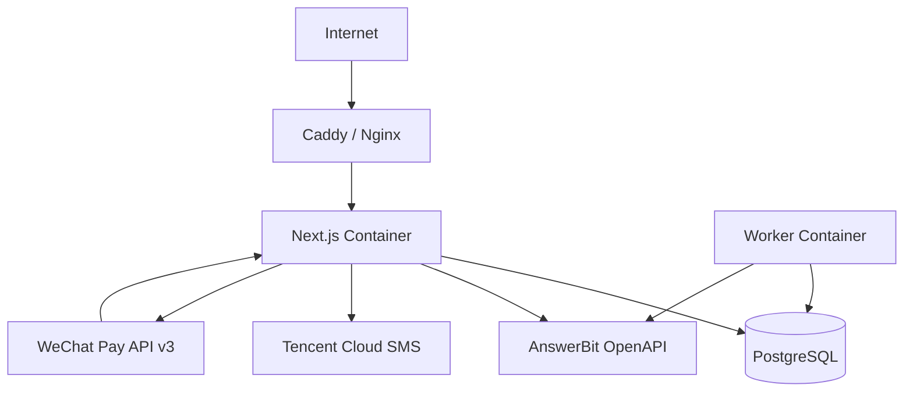

# GEO SaaS 平台技术设计文档（历史归档）

> 归档声明：本文不代表当前系统。当前架构、身份与余额规则分别以[系统总览](../architecture/system_overview.md)、[身份与访问控制](../domains/identity_and_access.md)和[余额计费与发布履约](../domains/balance_and_publication.md)为准；短信登录与在线支付设计已失效。

> 状态：初稿<br>
> 版本：0.3<br>
> 更新日期：2026-09-08<br>
> 适用阶段：MVP ～ 中低并发商业化阶段<br>
> 关联历史需求：[answerbit_saas_requirements_v1.md](./answerbit_saas_requirements_v1.md)

## 1. 文档目的

本文档描述一个基于腾讯 AnswerBit OpenAPI 的多租户 SaaS 平台技术方案。AnswerBit 提供品牌、竞品、监控问题、GEO 指标、大模型回答记录、引用分析、文章管理和计量中心能力；本平台在其基础上增加用户、租户、品牌级权限、产品化界面、报表、通知和运营管理。

AnswerBit 能力统一封装为 `AnswerBitProvider`，业务模块不直接依赖外部接口的请求和响应结构。

## 2. 背景与目标

### 2.1 背景

- 平台通过 AnswerBit OpenAPI 使用 GEO 能力，不直接调用大模型。
- 平台面向多个企业或团队使用，需要提供租户级数据隔离。
- 用户包含平台管理员、企业管理员，以及具有品牌管理员、编辑或只读权限的企业用户。
- 预计早期并发不高，应优先考虑开发效率、部署成本和维护成本。
- 后续可能增加更多 AnswerBit 接口、自有业务模块或其他第三方服务。

### 2.2 建设目标

1. 快速完成可商业化的 SaaS 基础能力。
2. 安全、稳定地对接 AnswerBit OpenAPI。
3. 实现明确的用户、租户、角色和权限体系。
4. 保证不同租户之间的数据隔离。
5. 保留未来拆分独立后端或后台任务服务的空间。
6. 尽量减少首期基础设施数量和运维复杂度。

### 2.3 非目标

MVP 阶段暂不建设：

- 微服务体系；
- Kubernetes 集群；
- Kafka 等大型消息系统；
- 复杂工作流引擎；
- 多地域容灾；
- 数据仓库和实时数仓；
- 过度细化的自定义角色编辑器。

## 3. 关键假设

1. AnswerBit Base URL 为 `https://answerbit.qq.com`，通过 `X-API-Key` 鉴权。
2. AnswerBit API Key 的团队、品牌及读写范围由申请时开通的权限决定。
3. 每个租户独立申请和维护 AnswerBit API Key，不跨租户共享。
4. 一个本地企业可以绑定多个 AnswerBit `team_id`，本地品牌授权同时关联 TeamID 和 BrandID。
5. 当前 Apifox 快照包含 48 个 POST 接口，接口响应使用 `code`、`msg`、`data` 包装结构。
6. AnswerBit 文章生成由独立 Worker 异步执行。
7. 平台建设独立套餐、权益额度、订单和支付系统，与 AnswerBit 计量分开。
8. 用户使用手机号和短信验证码登录。
9. AnswerBit 是否支持 Webhook、具体限流规则仍需确认。
10. 平台早期以 Web 管理端为主，暂不包含原生 App，系统初期采用单地域部署。

## 4. 技术方案决策

### 4.1 总体方案

采用 **TypeScript 全栈模块化单体**：

- Next.js 提供 React 页面、服务端渲染和 HTTP API；
- PostgreSQL 保存用户、租户、权限、业务和审计数据；
- AnswerBit 适配层负责鉴权、调用、字段转换和错误归一化；
- 独立 Node.js Worker 处理文章生成，并承载批量同步、定时同步和失败重试；
- 腾讯云短信负责登录验证码，微信支付 API v3 负责首期套餐支付。



### 4.2 推荐技术栈

| 分类     | 技术                     | 说明                                  |
| -------- | ------------------------ | ------------------------------------- |
| 全栈框架 | Next.js 16.3.x           | 页面、服务端组件和 Route Handlers     |
| UI       | React 19.2.x             | 使用最新稳定补丁版本                  |
| 开发语言 | TypeScript               | 前后端共享类型                        |
| Node.js  | Node.js 24 LTS           | 生产环境使用 LTS，不使用 Current 版本 |
| 样式     | Tailwind CSS 4           | 快速构建响应式界面                    |
| 组件库   | shadcn/ui                | 组件代码可控，适合管理后台            |
| 数据库   | PostgreSQL 18            | 关系数据、事务和行级安全              |
| ORM      | Drizzle ORM              | 类型安全且相对轻量                    |
| 参数校验 | Zod                      | 请求、配置和环境变量校验              |
| 身份认证 | Better Auth Phone Number | 手机号验证码登录和 Session            |
| 短信     | 腾讯云短信               | 验证码发送                            |
| 支付     | 微信支付 API v3 Native   | PC 端扫码购买套餐                     |
| 日志     | Pino                     | JSON 结构化日志                       |
| 测试     | Vitest + Playwright      | 单元、集成和端到端测试                |
| 异步任务 | pg-boss                  | 文章生成和补偿任务，复用 PostgreSQL   |
| 部署     | Docker Compose           | 适合早期单机或少量实例部署            |

具体依赖使用锁文件固定版本，并通过自动化依赖更新工具升级补丁版本。

### 4.3 为什么暂不采用前后端完全分离

- 项目早期团队和并发规模有限，一个 TypeScript 工程维护成本更低。
- 页面、API、鉴权和类型定义可以直接复用。
- AnswerBit 接口的主要瓶颈是外部网络调用，不是本地计算性能。
- 通过分层约束，未来仍可将 API 或 Worker 提取为独立服务。

## 5. 系统边界与模块

### 5.1 用户端

- 手机号验证码登录、退出和账户资料；
- 选择当前企业；
- 查看已授权的业务数据；
- 使用 AnswerBit GEO 能力；
- 使用平台增加的业务功能；
- 查看个人操作记录。

### 5.2 企业管理端

- 企业资料管理；
- 邀请、启用、禁用企业成员；
- 为成员分配角色；
- 配置租户自有 AnswerBit API Key 和多个 TeamID；
- 查看本平台套餐、额度、订单和支付记录；
- 查看本企业同步记录和调用记录；
- 管理本企业业务数据。

### 5.3 平台管理端

- 租户创建、查询、冻结和恢复；
- 用户查询、禁用和解锁；
- 套餐和额度配置；
- 订单、支付和退款管理；
- 全平台接口健康状况；
- 操作审计和异常记录；
- 全局业务配置。

### 5.4 AnswerBit 集成模块

- API 鉴权和请求签名；
- 连接测试；
- 请求参数映射；
- 响应字段归一化；
- 分页和限流处理；
- 超时、重试和错误归类；
- 若 AnswerBit 提供 Webhook，则负责验签与防重放；
- 调用量和调用结果记录。

### 5.5 商业化模块

- 套餐和不可变套餐版本；
- 订阅与权益快照；
- 额度预占、确认、释放和调整流水；
- 订单状态机；
- 微信 Native 下单、支付回调和主动查单；
- 退款和支付审计。

### 5.6 手机认证模块

- Better Auth Phone Number 插件；
- 腾讯云短信发送验证码；
- 手机号、IP 和设备维度限流；
- 验证码过期、尝试次数和人机验证控制。

## 6. 用户、租户与权限设计

### 6.1 角色模型

平台预置五个角色：

| 角色           | 作用范围 | 说明                               |
| -------------- | -------- | ---------------------------------- |
| `super_admin`  | 全平台   | 平台运营人员，可管理全部租户       |
| `tenant_admin` | 单个租户 | 企业管理员，可管理本企业配置和成员 |
| `brand_admin`  | 指定品牌 | 可管理品牌资料、品牌成员和业务数据 |
| `brand_editor` | 指定品牌 | 可编辑竞品、问题和文章             |
| `brand_viewer` | 指定品牌 | 普通用户，只读查看品牌数据         |

同一用户可以属于多个租户，并在不同租户中拥有不同角色。`super_admin` 属于平台级角色，不依赖当前租户。

### 6.2 权限点

首期权限点：

```text
platform.tenant.read
platform.tenant.manage
platform.user.read
platform.user.manage
platform.audit.read

tenant.settings.read
tenant.settings.manage
tenant.member.read
tenant.member.manage
tenant.audit.read

answerbit.connection.read
answerbit.connection.manage
answerbit.team.read
answerbit.team.manage
answerbit.resource.read
answerbit.resource.execute

billing.plan.read
billing.order.read
billing.order.create
billing.refund.manage

resource.read
resource.create
resource.update
resource.delete
```

角色与权限点之间通过配置映射，不在业务代码中散落 `isAdmin` 判断。

### 6.3 鉴权流程



前端权限只控制界面展示，最终权限必须由服务端再次校验。

## 7. 多租户设计

### 7.1 隔离方式

MVP 使用共享数据库、共享 Schema、业务表携带 `organization_id` 的方式。相较于每个租户独立数据库，该方案成本更低，也更易维护。

隔离规则：

1. 所有租户业务表必须包含 `organization_id`。
2. 所有 Repository 方法必须显式接收 `organizationId`。
3. 唯一索引通常包含 `organization_id`。
4. PostgreSQL 业务表启用 Row-Level Security。
5. 后台任务载荷必须包含并验证 `organizationId`。
6. 平台管理员跨租户查询使用独立服务和数据库角色。
7. 自动化测试必须覆盖跨租户读写失败场景。

### 7.2 租户上下文

服务端统一生成租户上下文：

```ts
type RequestContext = {
  requestId: string;
  userId: string;
  organizationId: string;
  teamBindingId?: string;
  brandId?: string;
  role: "tenant_admin" | "brand_admin" | "brand_editor" | "brand_viewer";
};
```

业务代码不得信任浏览器传入的用户 ID 或角色。服务端必须验证用户属于当前租户、TeamID 绑定属于当前租户，并且用户有权访问当前品牌。

## 8. 数据模型

### 8.1 核心表

```text
users
sessions
organizations
organization_members
roles
permissions
role_permissions
member_roles

answerbit_connections
answerbit_team_bindings
answerbit_api_calls
answerbit_webhook_events
answerbit_sync_jobs
article_generation_jobs

brand_access
answerbit_brand_mappings

business_resources
usage_records
plans
plan_versions
subscriptions
entitlements
quota_ledgers
orders
payment_transactions
refunds
sms_send_logs
operation_logs
login_logs
```

### 8.2 关键字段

#### users

```text
id                    uuid primary key
phone_number          varchar unique
phone_number_verified boolean
status                active | disabled
created_at            timestamptz
updated_at            timestamptz
```

#### organizations

```text
id                  uuid primary key
name                varchar
slug                varchar unique
status              active | suspended | closed
plan_code           varchar
created_at          timestamptz
updated_at          timestamptz
```

#### organization_members

```text
id                  uuid primary key
organization_id     uuid
user_id             uuid
status              invited | active | disabled
joined_at           timestamptz nullable
created_at          timestamptz

unique (organization_id, user_id)
```

#### brand_access

```text
id                  uuid primary key
organization_id     uuid
team_binding_id     uuid
brand_id            varchar
user_id             uuid
role                brand_admin | brand_editor | brand_viewer
created_at          timestamptz

unique (organization_id, team_binding_id, brand_id, user_id)
```

#### answerbit_connections

```text
id                  uuid primary key
organization_id     uuid
encrypted_api_key   text
api_key_fingerprint varchar
key_version         integer
status              active | invalid | disabled
last_checked_at     timestamptz nullable
created_by          uuid
created_at          timestamptz
updated_at          timestamptz
```

#### answerbit_team_bindings

```text
id                  uuid primary key
organization_id     uuid
connection_id       uuid
team_id             varchar
display_name        varchar nullable
is_default          boolean
status              active | invalid | disabled
last_synced_at      timestamptz nullable
last_checked_at     timestamptz nullable
created_at          timestamptz
updated_at          timestamptz

unique (organization_id, team_id)
```

#### answerbit_api_calls

```text
id                  uuid primary key
organization_id     uuid
connection_id       uuid
request_id          varchar
operation           varchar
answerbit_code      integer nullable
status              success | failed | timeout
http_status         integer nullable
duration_ms         integer
error_code          varchar nullable
created_at          timestamptz
```

#### article_generation_jobs

```text
id                  uuid primary key
organization_id     uuid
team_binding_id     uuid
brand_id            varchar
requested_by        uuid
idempotency_key     varchar
status              queued | running | succeeded | failed | cancelled
answerbit_article_id varchar nullable
attempt_count       integer
error_code          varchar nullable
started_at          timestamptz nullable
completed_at        timestamptz nullable
created_at          timestamptz

unique (organization_id, idempotency_key)
```

#### plan_versions / subscriptions / quota_ledgers

```text
plan_versions
- id, plan_id, version, billing_cycle
- currency, price_amount, entitlements(jsonb), status
- published_at

subscriptions
- id, organization_id, plan_version_id, status
- current_period_start, current_period_end
- source_order_id, created_at, updated_at

quota_ledgers
- id, organization_id, subscription_id, entitlement_key
- operation, amount, balance_after
- reference_type, reference_id, idempotency_key, created_at
```

`quota_ledgers` 是额度审计事实来源，余额快照只用于加速查询。`(organization_id, idempotency_key)` 唯一，防止任务重试导致重复扣减。

#### orders

```text
id                  uuid primary key
organization_id     uuid
order_no            varchar unique
plan_version_id     uuid
status              pending | paid | fulfilled | closed | refunding | refunded
currency            varchar
original_amount     integer
discount_amount     integer
payable_amount      integer
expires_at          timestamptz
paid_at             timestamptz nullable
created_by          uuid
created_at          timestamptz
updated_at          timestamptz
```

金额统一使用最小货币单位整数保存，人民币即“分”，禁止使用浮点数。

#### payment_transactions

```text
id                      uuid primary key
organization_id         uuid
order_id                 uuid
provider                 wechat
provider_transaction_id varchar nullable
status                   pending | succeeded | failed | closed | refunded
amount                   integer
currency                 varchar
raw_event_digest         varchar nullable
paid_at                  timestamptz nullable
created_at               timestamptz
updated_at               timestamptz

unique (provider, provider_transaction_id)
```

日志表默认不保存密钥、Token、身份证号、手机号等敏感字段。请求和响应内容需要经过脱敏后才能记录。

## 9. 外部集成与异步任务设计

### 9.1 适配层接口

```ts
export interface AnswerBitProvider {
  testConnection(): Promise<{ ok: boolean; message?: string }>;

  listBrands(teamId: string): Promise<AnswerBitBrand[]>;

  getDashboard(input: DashboardQuery): Promise<DashboardMetrics>;

  execute(input: {
    operation: string;
    payload: unknown;
    idempotencyKey: string;
  }): Promise<AnswerBitOperationResult>;
}
```

业务 Service 只依赖该接口，不直接依赖 AnswerBit 原始请求和响应类型。

### 9.2 推荐目录结构

```text
src/server/integrations/answerbit/
├── client.ts
├── provider.ts
├── auth.ts
├── schemas.ts
├── mapper.ts
├── errors.ts
├── webhook.ts
└── modules/
    ├── brands.ts
    ├── prompts.ts
    ├── dashboard.ts
    ├── answers.ts
    ├── articles.ts
    └── billing.ts
```

### 9.3 调用策略

- 默认连接超时：3 秒；
- 普通查询总超时：15 秒；
- 普通写操作总超时：20 秒；
- 文章生成单次调用超时：120 秒，任务最大运行时间：5 分钟；
- 查询请求对连接失败、连接重置和 5xx 最多重试 2 次；
- 写请求仅在具有幂等键或 AnswerBit 明确支持幂等时自动重试；
- 在官方限额确认前，每个 AnswerBit 连接使用独立并发信号量，默认并发 3，可通过配置中心调整；
- 对限流响应采用指数退避；
- 每次调用生成平台 `request_id`；
- 保存 AnswerBit 返回的外部请求标识，便于问题排查；
- 将 AnswerBit 错误转换为平台统一错误码，不把内部异常直接返回浏览器。

### 9.4 Webhook 处理（条件能力）

当前公开 OpenAPI 未确认 Webhook。本节仅在 AnswerBit 提供回调能力后启用，接口示例：

```text
POST /api/v1/webhooks/answerbit
```

处理顺序：

1. 读取原始请求体；
2. 校验签名和时间戳；
3. 检查时间窗口，防止重放；
4. 根据 AnswerBit 事件 ID 执行幂等检查；
5. 保存事件摘要和处理状态；
6. 更新业务数据或创建异步任务；
7. 在 AnswerBit 要求的时间内返回确认结果。

若 AnswerBit 后续确认支持 Webhook，`answerbit_webhook_events` 对 `external_event_id` 建立唯一索引。

### 9.5 异步任务

以下场景启用 pg-boss 和独立 Worker：

- AnswerBit 文章生成；
- 批量同步 AnswerBit 数据；
- 定时同步；
- 单次任务持续时间较长；
- 调用需要自动重试；
- AnswerBit 接口存在严格限流。

所有异步处理都按“至少一次执行”设计，业务写入必须保证幂等。

文章生成流程：

```text
Route Handler 创建 article_generation_jobs
    -> 同一事务扣减/预占本平台额度并发送 pg-boss 任务
    -> Worker 标记 running
    -> 调用 /geo/article/create
    -> 调用 /geo/article/get 获取结果
    -> 成功：确认额度并标记 succeeded
    -> 失败：释放额度并标记 failed
```

请求超时但无法确认 AnswerBit 是否已执行时，任务进入人工核对状态，不直接再次生成，避免重复消耗 AnswerBit 积分。

### 9.6 手机号登录

- Better Auth Phone Number 插件负责手机号身份和 Session；
- 腾讯云短信 `SendSms` 负责发送 6 位验证码；
- 手机号统一转换为 E.164 格式并建立唯一索引；
- 验证码只保存哈希，5 分钟失效，最多验证 3 次；
- 发送接口统一返回模糊结果，不泄露手机号是否已经注册；
- 使用数据库实现手机号、IP、设备三个维度的频率限制；
- 达到风险阈值后启用验证码挑战；
- 短信日志仅保存掩码手机号、模板、供应商请求 ID、状态和错误码。

### 9.7 套餐与额度

套餐采用版本化设计：`plans` 表示逻辑套餐，`plan_versions` 保存某一时刻不可变的价格和权益。订单必须引用具体套餐版本，避免套餐调整影响历史订单。

额度操作使用流水而不是直接覆盖余额：

```text
reserve   创建消耗型任务时预占
commit    任务成功后确认消耗
release   任务失败或取消后释放
grant     订阅开通或管理员赠送
adjust    管理员人工调整
expire    套餐周期结束后失效
```

文章生成时，数据库事务必须同时完成额度预占和任务入队，避免“已扣额度但任务未创建”或“任务已创建但未扣额度”。

### 9.8 微信支付

首期实现微信支付 API v3 Native，抽象统一支付接口：

```ts
export interface PaymentProvider {
  createPayment(input: CreatePaymentInput): Promise<PaymentIntent>;
  queryPayment(providerTransactionId: string): Promise<PaymentResult>;
  closePayment(orderNo: string): Promise<void>;
  refund(input: RefundInput): Promise<RefundResult>;
  verifyAndDecryptNotification(input: RawNotification): Promise<PaymentEvent>;
}
```

支付处理原则：

1. 金额统一使用最小货币单位整数；
2. 商户订单号全局唯一；
3. 支付通知先验签和解密，再核对商户号、订单号、币种和金额；
4. `provider_transaction_id` 建立唯一索引；
5. 重复通知直接返回成功，不重复开通权益；
6. 支付成功、订阅开通、权益发放和支付流水在同一事务完成；
7. 前端轮询只刷新状态，不作为支付成功依据；
8. 定时查单补偿通知丢失，超时未支付订单由任务关闭。

## 10. API 设计

API 使用 `/api/v1` 前缀，返回统一 JSON 结构。

### 10.1 用户和租户

```text
POST   /api/auth/phone-number/send-otp
POST   /api/auth/phone-number/verify
POST   /api/auth/sign-out

GET    /api/v1/me
GET    /api/v1/organizations
POST   /api/v1/organizations
GET    /api/v1/organizations/:organizationId
PATCH  /api/v1/organizations/:organizationId

GET    /api/v1/organizations/:organizationId/members
POST   /api/v1/organizations/:organizationId/invitations
PATCH  /api/v1/organizations/:organizationId/members/:memberId
DELETE /api/v1/organizations/:organizationId/members/:memberId
```

### 10.2 AnswerBit 连接与团队

```text
GET    /api/v1/answerbit/connections
POST   /api/v1/answerbit/connections
POST   /api/v1/answerbit/connections/:connectionId/test
PATCH  /api/v1/answerbit/connections/:connectionId
DELETE /api/v1/answerbit/connections/:connectionId
GET    /api/v1/answerbit/teams
POST   /api/v1/answerbit/teams
POST   /api/v1/answerbit/teams/:teamBindingId/test
PATCH  /api/v1/answerbit/teams/:teamBindingId
DELETE /api/v1/answerbit/teams/:teamBindingId
POST   /api/v1/answerbit/sync-jobs
GET    /api/v1/answerbit/sync-jobs/:jobId
POST   /api/v1/article-generation-jobs
GET    /api/v1/article-generation-jobs/:jobId
```

### 10.3 套餐、订单和支付

```text
GET    /api/v1/plans
GET    /api/v1/subscription
GET    /api/v1/entitlements
GET    /api/v1/orders
POST   /api/v1/orders
GET    /api/v1/orders/:orderId
POST   /api/v1/orders/:orderId/payments/wechat/native
POST   /api/v1/payments/wechat/notify
POST   /api/v1/orders/:orderId/refresh-status
```

### 10.4 平台管理

```text
GET    /api/v1/admin/organizations
PATCH  /api/v1/admin/organizations/:organizationId/status
GET    /api/v1/admin/users
PATCH  /api/v1/admin/users/:userId/status
GET    /api/v1/admin/audit-logs
GET    /api/v1/admin/answerbit-api-calls
GET    /api/v1/admin/orders
POST   /api/v1/admin/orders/:orderId/refunds
```

### 10.5 响应格式

成功：

```json
{
  "data": {},
  "requestId": "REQUEST_ID"
}
```

失败：

```json
{
  "error": {
    "code": "ANSWERBIT_RATE_LIMITED",
    "message": "服务繁忙，请稍后重试"
  },
  "requestId": "REQUEST_ID"
}
```

## 11. 代码组织

```text
geo/
├── apps/
│   ├── web/
│   │   ├── src/app/
│   │   ├── src/components/
│   │   └── src/server/
│   │       ├── auth/
│   │       ├── permissions/
│   │       ├── services/
│   │       ├── repositories/
│   │       ├── integrations/answerbit/
│   │       └── audit/
│   └── worker/                 # 需要异步任务时启用
├── packages/
│   ├── db/
│   ├── contracts/
│   ├── core/
│   └── config/
├── docs/
├── docker-compose.yml
└── pnpm-workspace.yaml
```

依赖方向：

```text
Route Handler
    -> Permission Guard
    -> Application Service
    -> Repository / AnswerBit Provider
    -> PostgreSQL / AnswerBit OpenAPI
```

Route Handler 不直接访问数据库，不直接调用 AnswerBit，不承载复杂业务逻辑。

## 12. 安全设计

### 12.1 凭证管理

- 平台级密钥通过部署环境的 Secret 管理能力注入；
- 租户级 AnswerBit API Key 使用信封加密后入库；
- 加密主密钥不得和数据库存放在一起；
- 提供密钥版本字段，支持后续轮换；
- API 永远不返回完整密钥，只返回掩码；
- 日志系统对请求头、Token 和敏感字段进行过滤。

### 12.2 应用安全

- 所有写请求进行 Session、租户和权限三层校验；
- 使用 Zod 校验所有外部输入；
- Cookie 使用 `HttpOnly`、`Secure` 和合理的 `SameSite` 策略；
- 状态修改接口启用 CSRF 防护；
- 登录和敏感接口增加速率限制；
- 验证码不得明文保存，手机号、IP、设备分别限流；
- 验证码登录响应不得泄露手机号是否已注册；
- 微信支付通知必须验签、解密、金额核对和幂等处理；
- 微信商户私钥、API v3 密钥和平台公钥通过 Secret 管理；
- 邀请链接和重置链接必须短期有效且只能使用一次；
- 管理员敏感操作写入不可随意修改的审计日志；
- 导出数据必须执行与列表查询相同的租户和权限校验。

### 12.3 审计日志

至少记录：

- 操作人；
- 所属租户；
- 操作类型；
- 资源类型和资源 ID；
- 修改前后摘要；
- 请求 ID、IP 和 User-Agent；
- 操作时间和结果。

API Key、支付密钥、验证码明文、Session 和 Token 禁止进入审计日志。

## 13. 可观测性

- 每个进入系统的请求生成 `requestId`；
- AnswerBit 调用日志关联平台 `requestId` 和外部请求标识；
- 输出 JSON 结构化日志；
- 提供 `/api/health/live` 和 `/api/health/ready`；
- 监控接口成功率、P95 延迟、AnswerBit 错误率和同步积压量；
- 监控短信发送成功率、生成任务积压、支付回调失败和主动查单异常；
- 对登录异常、跨租户拒绝访问，以及启用后的 Webhook 验签失败设置告警；
- 错误追踪平台可在生产阶段接入，不作为本地开发前置条件。

## 14. 测试策略

### 14.1 单元测试

- 角色与权限映射；
- AnswerBit 字段转换；
- 签名和验签；
- 错误码转换；
- 幂等键生成；
- 套餐版本和权益计算；
- 额度预占、确认和释放；
- 订单状态转换和支付金额校验；
- Zod 输入校验。

### 14.2 集成测试

- Repository 数据访问；
- Row-Level Security；
- Session 和权限 Guard；
- AnswerBit API Mock；
- 腾讯云短信 Mock；
- 微信支付下单、通知验签和查单 Mock；
- 启用 Webhook 后验证重复事件幂等处理；
- AnswerBit 成功但本地事务失败等异常路径。

### 14.3 端到端测试

- 管理员创建租户；
- 企业管理员邀请成员；
- 普通用户访问授权功能；
- 普通用户访问管理页面被拒绝；
- 租户 A 无法访问租户 B 数据；
- 手机号验证码登录和防刷限制；
- 创建 AnswerBit 连接并绑定多个 TeamID；
- 创建文章生成任务并由 Worker 完成；
- 重复支付通知只开通一次订阅权益；
- 启用 Webhook 后验证回调到业务数据更新完整链路。

## 15. 部署方案

### 15.1 MVP 部署拓扑



推荐运行单元：

1. 一个 Next.js 容器；
2. 一个托管 PostgreSQL 实例；
3. 一个反向代理或云负载均衡；
4. 一个 Worker 容器；
5. 对象存储用于导出文件和附件。

生产环境优先使用托管 PostgreSQL。应用容器保持无状态，以便后续水平扩容。

### 15.2 环境划分

```text
local       本地开发
staging     AnswerBit、短信、支付联调及回归测试
production  正式环境
```

三个环境使用独立数据库、AnswerBit 凭证、短信配置、支付配置和回调地址。生产支付商户配置不得在测试环境使用。

## 16. 实施计划

### 阶段一：工程与 SaaS 基础

- 初始化 Next.js、数据库和迁移；
- 实现手机号验证码登录、Session、防刷和用户状态；
- 实现组织、成员和角色；
- 实现权限 Guard 和租户上下文；
- 建立管理员后台框架。

### 阶段二：AnswerBit 对接

- 根据 AnswerBit OpenAPI 补充 Provider；
- 实现租户自有凭证加密、多 TeamID 绑定和连接测试；
- 实现核心业务操作；
- 实现调用日志和错误映射；
- 实现文章生成异步任务；
- 若 AnswerBit 提供回调能力，再实现 Webhook。

### 阶段三：商业化和附加业务功能

- 实现套餐版本、订阅、权益和额度流水；
- 实现订单状态机和微信 Native 支付；
- 实现支付回调、主动查单和退款；
- 增加平台差异化业务能力；
- 增加租户配置和数据展示；
- 增加操作审计和使用量统计；
- 补齐导入、导出和批量操作。

### 阶段四：上线加固

- 租户隔离专项测试；
- 权限矩阵测试；
- AnswerBit 异常及限流测试；
- 短信防刷和支付安全测试；
- 数据备份和恢复演练；
- 监控、告警和发布回滚流程。

## 17. 扩展与拆分条件

满足以下任一条件时，再考虑拆分独立服务：

- AnswerBit 同步任务明显影响 Web 请求；
- Worker 需要独立扩容；
- 出现 App、小程序或大量开放 API 调用方；
- 单个模块需要不同发布周期；
- 团队规模增大，需要明确服务所有权；
- Node.js 无法满足某类计算密集任务。

建议优先拆出 Worker，其次才是公共 API。不要仅因为“架构先进”提前拆分微服务。

## 18. 默认实现参数与外部确认项

### 18.1 默认实现参数

- 每个 AnswerBit 连接默认并发 3，可配置；
- 普通查询超时 15 秒，写操作超时 20 秒；
- 文章生成单次上游超时 120 秒，任务最大运行 5 分钟；
- AnswerBit 指标缓存 5 分钟，并展示实际数据更新时间；
- 订单有效期 30 分钟；
- 首期使用微信直连商户 Native 支付，不启用自动续费；
- 退款由平台管理员人工发起；
- 套餐升级立即生效，降级在当前周期结束后生效；
- CSV 和站内通知优先，PDF、邮件和企业微信后续实现；
- AnswerBit 接口调用和审计日志默认保存 180 天，导出文件默认保存 7 天。

### 18.2 需要外部确认

1. AnswerBit 正式限流、日调用上限和单 Key TeamID 上限；
2. AnswerBit 文章生成超时后的结果核对机制；
3. 首发套餐价格和各项额度；
4. 微信支付生产商户配置；
5. 最终退款、开票和数据合规政策。

## 19. 验收标准

- 用户可以正常登录并切换其有权访问的企业；
- 手机号验证码登录具备过期、尝试次数和频率限制；
- 平台管理员、企业管理员和普通用户权限符合权限矩阵；
- 任意租户均不能访问其他租户数据；
- AnswerBit API Key 不出现在浏览器响应或明文日志中；
- AnswerBit 核心接口调用成功，失败时提供可追踪的请求 ID；
- 每个租户使用独立 API Key，并可绑定多个 TeamID；
- 文章生成通过 Worker 异步执行并正确结算额度；
- 微信支付回调通过验签、金额核对和幂等测试；
- 套餐、订阅、本地额度和 AnswerBit 积分分别核算；
- 若启用 Webhook，重复事件不会重复创建业务数据；
- 管理员敏感操作可以通过审计日志追溯；
- 数据库能够完成备份和恢复；
- 核心用户流程通过端到端自动化测试。
